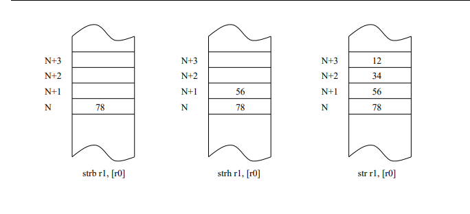
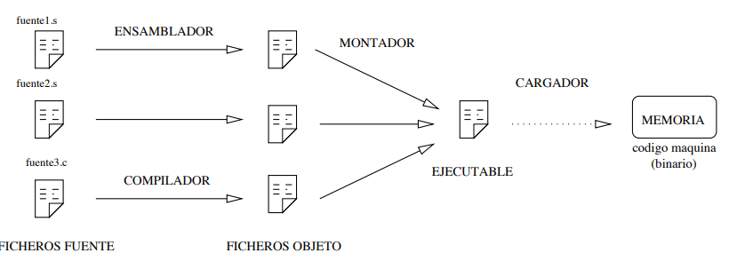
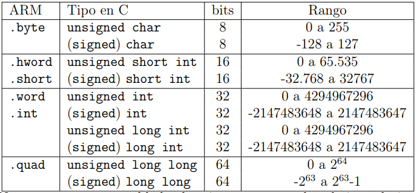

#  Tecnológico Nacional de México
#  Instituto Tecnológico de Tijuana
#  Subdirección Académica

#  Departamento de Sistemas y Computación
#  Ingeniería en Sistemas Computacionales
#  Lenguajes de interfaz 

#  Reumen Bloque 1

# Alumno:📝 
# Mendoza Perez Max William #17620246
   

# Profesor:
# MC. René Solis Reyes
# Semestre sep - ene 2020


-----
# Características generales de la arquitectura ARM


#### ARM es una arquitectura RISC de 32 bits, salvo la versión del core ARMv8- A que es mixta 32/64 bits . Se trata de una arquitectura licenciable, quiere decir que la empresa desarrolladora ARM Holdings diseña la arquitectura, pero son otras compañías las que fabrican y venden los chips, llevándose ARM Holdings un pequeño porcentaje por la licencia. El chip en concreto que lleva la Raspberry Pi es el BCM2835, se trata de un SoC que contiene además de la CPU otros elementos como un núcleo GPU y un núcleo DSP que es un procesador más pequeño y simple que el principal, pero especializado en el procesado y representación de señales analógicaa.

## Esquema de almacenamiento



## Lenguaje Ensamblador

#### El ensamblador es un lenguaje de bajo nivel que permite un control directo de la CPU y todos los elementos asociados. Cada línea de un programa ensamblador consta de una instrucción del procesador y la posición que ocupan los datos de esa instrucción. Desarrollar programas en lenguaje ensamblador es un proceso laborioso. El ensamblador presenta una serie de ventajas e inconvenientes con respecto a otros lenguajes de más alto nivel.
#### En contrapartida, programar en ensamblador es laborioso puesto que los programas contienen un número elevado de líneas y la corrección y depuración de éstos se hace difícil.


## Entorno 

#### Para traducirlo a lenguaje máquina hay que utilizar un programa traductor. Éste genera un fichero con la traducción de dicho programa, pero todavía no es un programa ejecutable. Un fichero ejecutable contiene el programa traducido más una serie de códigos que debe tener todo programa que vaya a ser ejecutado en una máquina determinada. El encargado de unir el código del programa con el código de estas librerías es un programa llamado montador que genera el programa ejecutable.

#### Durante el proceso de creación de un programa se suelen producir errores. Los errores sintácticos son, por ejemplo, escribir mal una instrucción o hacer una operación entre dos tipos de datos incompatibles. Estos errores son detectados por el traductor y se deben solucionar para poder generar un ejecutable. Una vez que se tiene un programa sintácticamente correcto lo podemos ejecutar, pero esto no implica que el programa sea correcto.

#### Todas las instrucciones pueden ser correctas, pero se puede haber olvidado poner la condición de salida de un bucle o que sencillamente el programa no haga lo que queremos. Estos errores sólo se pueden detectar en tiempo de ejecución. El depurador nos permite ejecutar el programa instrucción a instrucción y ver todos los valores que se van a calcular, de manera que podemos encontrar los errores.




<a href="http://cooltext.com" target="_top"></a>


## Modos de direccionamiento del ARM

#### En la arquitectura ARM los accesos a memoria se hacen mediante instrucciones específicas ldr y El resto de instrucciones toman operandos desde registros o valores inmediatos, sin excepciones. En este caso la arquitectura nos fuerza a que trabajemos de un modo determinado: primero cargamos los registros desde memoria, luego procesamos el valor de estos registros con el amplio abanico de instrucciones del ARM, para finalmente volcar los resultados desde registros a memoria. Normalmente se opta por direccionamiento a memoria en instrucciones de procesado en arquitecturas con un número reducido de registros, donde se emplea la memoria como almacén temporal.

### Direccionamiento inmediato.
```s
   mov r0, # 1
   add r2, r3, #4
```

### Direccionamiento inmediato con desplazamiento o rotación.
```s
mov r1, r2, LSL #1 /* r1 <- (r2*2) */
mov r1, r2, LSL #2 /* r1 <- (r2*4) */
mov r1, r3, ASR #3 /* r1 <- (r3/8) */
```

## Tipos de datos


#### Punteros. Un puntero siempre ocupa 32 bits y contiene una dirección de memoria. En ensamblador no tienen tanta utilidad como en C, ya que disponemos de registros de sobra y es más costoso acceder a las variables a través de los punteros que directamente. En este ejemplo acceder a la dirección de var1 nos cuesta 2 ldrs a través del puntero, mientras que directamente se puede hacer con uno sólo.

```s
.data
var1 :                .word 3
puntero_var1 :        .word var1
.text
.global  main
main :   ldr          r0, = puntero_var1
         ldr          r1, [ r0 ]
         ldr          r2, [ r1 ]
         ldr          r3, = var1
         bx           lr

```

